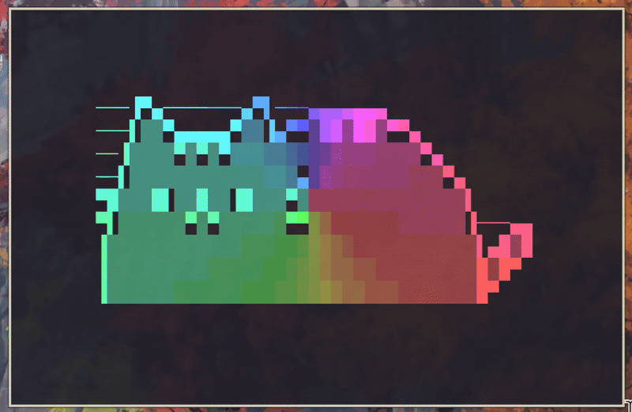

# terminal-flow



> *I wanted something more customizable for hyprland, so I created this with love, dark magic, and way too much caffeine.* ☕✨

A colorful Python terminal user interface (TUI) application that displays ASCII text files with dynamic rainbow animations and visual effects. Built with pure Python curses for zero external dependencies and optimal performance.

## Features

### Performance Optimized
- **Zero External Dependencies** - Pure Python standard library implementation
- **Curses-based** - Flicker-free animation using optimized screen updates
- **Variable FPS** - Choose between 5, 10, 30, or 60 FPS for performance tuning
- **Memory Efficient** - Minimal resource usage suitable for 24/7 operation

### Animation Modes
- **Wave** - Rainbow wave effect flowing horizontally across ASCII art
- **Spin** - Colors rotate around the center point using polar coordinates
- **Pulse** - Ripple effects pulsing outward from the center
- **Flux** - Uniform color cycling across all characters simultaneously
- **Morph** - 3D wave field animation with mathematical wave propagation

### Color System
- **Prism Colors** - Full rainbow spectrum with HSV color generation (default)
- **Monochromatic Gradients** - 9 color schemes: red, blue, green, yellow, purple, cyan, gray, pink, orange
- **256-Color Support** - Rich color depth with 8-color terminal fallback

### File Management
- **Smart File Selection** - Random selection by default, specific file targeting, or auto-cycling
- **Text Directory Support** - Reads ASCII art from customizable text directory
- **UTF-8/ASCII Support** - Automatic encoding detection with fallback handling

## Installation

### Prerequisites
- Python 3.8 or higher
- Terminal with curses and color support
- TTY environment (not compatible with dumb terminals)

### Install with pipx (Recommended)
```bash
# Install pipx if you don't have it
python3 -m pip install --user pipx
python3 -m pipx ensurepath

# Install terminal-flow
pipx install git+https://github.com/kestalkayden/terminal-flow.git
```

### Alternative Installation
```bash
# Clone and install locally
git clone https://github.com/kestalkayden/terminal-flow.git
cd terminal-flow
pip install -e .
```

## Usage

### Basic Usage
```bash
# Run with default settings (random file, wave mode, rainbow colors)
python -m terminal_flow.curses_main

# Display specific file with pulse animation and red gradient
python -m terminal_flow.curses_main --file spin --mode pulse --color red

# Auto-cycle through files with spin mode and blue colors
python -m terminal_flow.curses_main --cycle 15 --mode spin --color blue --hd

# Minimal CPU usage for 24/7 ambient display with flux mode
python -m terminal_flow.curses_main --uld --cycle --mode flux --color orange
```

### Command Line Options
```bash
python -m terminal_flow.curses_main --help                    # Show help
python -m terminal_flow.curses_main --mode wave               # Animation mode: wave, spin, pulse, flux, morph
python -m terminal_flow.curses_main --color red               # Color scheme: red, blue, green, yellow, purple, cyan, gray, pink, orange
python -m terminal_flow.curses_main --speed 1.5               # Animation speed multiplier
python -m terminal_flow.curses_main --file spin             # Display specific file (spin.txt)
python -m terminal_flow.curses_main --cycle 30                # Auto-cycle files every 30 seconds
python -m terminal_flow.curses_main --ld                      # Low definition (10 FPS, default)
python -m terminal_flow.curses_main --md                      # Medium definition (30 FPS)
python -m terminal_flow.curses_main --hd                      # High definition (60 FPS)
python -m terminal_flow.curses_main --uld                     # Ultra-low definition (5 FPS)
```

### Performance Options
- `--uld` - Ultra-low definition: 5 FPS (minimal CPU usage)
- `--ld` - Low definition: 10 FPS (default, efficient)
- `--md` - Medium definition: 30 FPS (smooth animation)
- `--hd` - High definition: 60 FPS (maximum smoothness)

### File Selection
- `--file <name>` - Display specific file (e.g., `--file spin` for spin.txt)
- `--cycle [seconds]` - Auto-cycle through files (default: 30 seconds)
- No options: Random file selection from text/ directory

### Animation & Color Options
- `--mode <mode>` - Animation mode: wave, spin, pulse, flux, morph (default: wave)
- `--color <scheme>` - Color scheme: red, blue, green, yellow, purple, cyan, gray, pink, orange (default: rainbow)
- `--speed <multiplier>` - Animation speed (default: 1.0)

### Runtime Controls (while application is running)
- **Left Arrow** - Navigate to previous file
- **Right Arrow** - Navigate to next file
- **C/c** - Cycle through color schemes (rainbow → red → blue → green → yellow → purple → cyan → gray → pink → orange)
- **M/m** - Switch animation modes (wave → spin → pulse → flux → morph)
- **Q/ESC** - Quit application

## Text Files

The application includes a built-in `text/` folder for your ASCII art files:
```
text/
├── spin.txt           # Project welcome message
├── arch.txt           # Arch Linux logo
├── nyan.txt           # Nyan cat animation
├── spiral.txt         # Geometric spiral pattern
├── heart.txt          # Unicode heart art
├── galaxy.txt         # Cosmic galaxy art
└── ... (11 files total)
```

**File Selection Modes:**
- **Default**: Random file selection from available .txt files
- **Specific**: Use `--file <name>` to target a specific file (e.g., `--file spin` for spin.txt)
- **Cycling**: Use `--cycle [seconds]` to automatically rotate through all files

Simply drop your `.txt` files into the `text/` directory and terminal-flow will handle the rest!

## Examples

### Animation Mode Combinations
```bash
# Wave mode with blue gradient - horizontal flowing effect
python -m terminal_flow.curses_main --mode wave --color blue

# Spin mode with orange gradient - spinning around center point
python -m terminal_flow.curses_main --mode spin --color orange

# Pulse mode with purple gradient - ripple effects from center
python -m terminal_flow.curses_main --mode pulse --color purple

# Flux mode with pink gradient - uniform color cycling
python -m terminal_flow.curses_main --mode flux --color pink

# Morph mode with green gradient - 3D wave field animation
python -m terminal_flow.curses_main --mode morph --color green
```

### Performance & File Management
```bash
# High-performance cycling display for presentations
python -m terminal_flow.curses_main --hd --cycle 10 --mode spin

# Energy-efficient 24/7 display
python -m terminal_flow.curses_main --uld --cycle 60 --mode flux --color cyan

# Interactive file exploration (use arrow keys to navigate)
python -m terminal_flow.curses_main --file spin --mode wave

# Fast animation with specific color scheme
python -m terminal_flow.curses_main --speed 2.0 --mode pulse --color red --md
```

### Creative Combinations
```bash
# Slow, meditative orange flux for background ambiance
python -m terminal_flow.curses_main --speed 0.5 --mode flux --color orange --ld

# Rapid rainbow spin for dynamic displays
python -m terminal_flow.curses_main --speed 1.5 --mode spin --hd

# Gentle blue pulse effect for focus sessions
python -m terminal_flow.curses_main --mode pulse --color blue --speed 0.8

# Cycling green wave for nature-themed displays
python -m terminal_flow.curses_main --cycle 20 --mode wave --color green
```


## Contributing

1. Fork the repository
2. Create a feature branch (`git checkout -b feature/amazing-feature`)
3. Commit your changes (`git commit -m 'Add amazing feature'`)
4. Push to the branch (`git push origin feature/amazing-feature`)
5. Open a Pull Request

## License

This project is licensed under the MIT License - see the [LICENSE](LICENSE) file for details.

## Acknowledgments

- Inspired by cmatrix, terminal-rain-lightning and other curses animation projects
- ASCII art community for creative text designs
- Python curses library documentation and examples